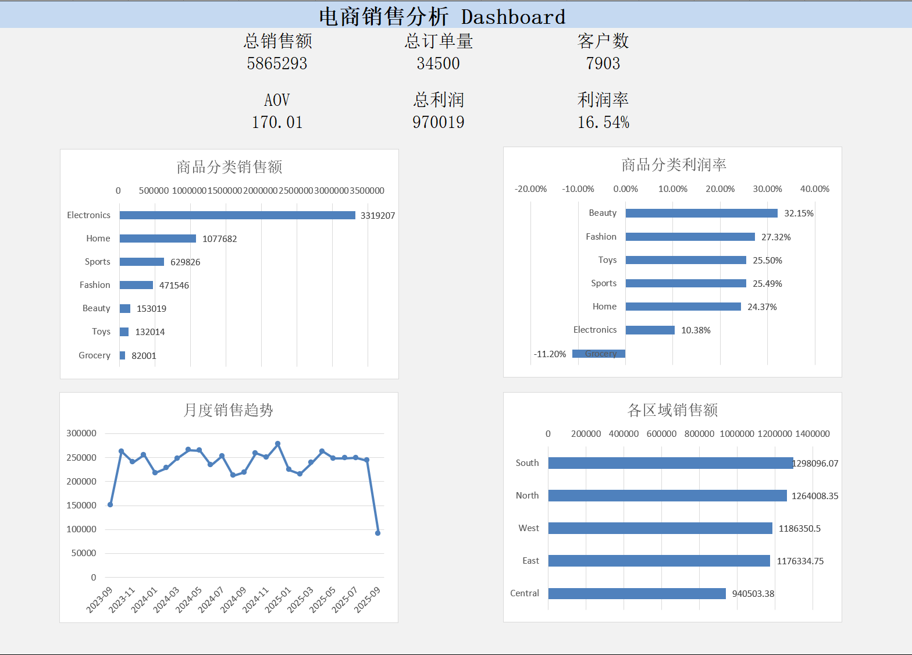

# E-commerce Sales & Customer Analysis

## English Summary

This project presents an end-to-end analysis of **34,500 e-commerce orders from 7,903 customers**.

## 项目简介

本项目基于Kaggle平台公开的电商销售交易数据集（E-commerce Sales Transactions Dataset），使用 Python 和 Excel 对销售表现、商品结构、区域表现以及客户行为进行分析，并通过客户分群识别不同价值的客户群体。

项目目标是从订单数据中发现关键业务问题，并将分析结果转化为可执行的业务建议。

---

## 📌 项目概述

本项目共分析：

- **34,500 条订单记录**
- **7,903 名客户**
- 订单时间跨度：2023–2025 年

主要分析方向包括：

- 整体销售与盈利表现
- 月度销售趋势
- 商品分类表现
- 区域销售表现
- 客户画像分析
- 客户购买频率分析
- 复购客户分析
- 高价值客户分析
- 客户分群
- Excel Dashboard 可视化

---

## 🛠️ 使用工具

- Python
- Pandas
- NumPy
- Matplotlib
- Jupyter Notebook
- Microsoft Excel
- PivotTable（数据透视表）
- PivotChart（数据透视图）

---

## 🔄 项目分析流程

整个项目按照以下流程完成：

1. 数据读取与基本检查
2. 数据质量检查
3. 数据清洗
4. 日期及业务特征构造
5. 核心 KPI 分析
6. 月度销售趋势分析
7. 商品分类分析
8. 区域销售分析
9. 客户画像分析
10. 客户购买频率分析
11. 复购客户分析
12. 高价值客户分析
13. 客户分群
14. Excel Dashboard 制作
15. 业务洞察与建议

---

## 📊 核心 KPI

| 指标 | 结果 |
|---|---:|
| 总销售额 | 5,865,293.05 |
| 总订单量 | 34,500 |
| 客户数 | 7,903 |
| 平均客单价（AOV） | 170.01 |
| 总利润 | 970,019.41 |
| 整体利润率 | 16.54% |
| 退货率 | 5.52% |
| 复购率 | 93.99% |

---

## 🔍 核心业务洞察

### 1. Electronics 是最主要的销售来源

Electronics 销售额约为 **331.92 万**，占整体销售额约 **56.59%**，是当前业务最主要的收入来源。

但 Electronics 的利润率仅约为 **10.38%**，明显低于 Beauty、Fashion、Sports、Toys 等商品分类。

这说明 Electronics 虽然能够带来大量销售额，但其盈利效率相对较低。

**业务建议：**

在保持 Electronics 销售规模的同时，应进一步分析商品成本、折扣和其他相关成本，寻找提升利润空间的机会。

---

### 2. Grocery 是唯一整体亏损的商品分类

Grocery 的销售额约为 **8.20 万**，利润约为 **-0.92 万**，整体利润率约为 **-11.20%**。

这是所有商品分类中唯一出现整体亏损的品类。

**业务建议：**

进一步分析 Grocery 的商品定价、折扣、运输成本等因素，定位造成亏损的主要原因，并评估是否需要调整定价或运营策略。

---

### 3. 复购客户是销售收入的重要支撑

整体客户复购率达到约 **93.99%**。

复购客户贡献了约 **98.57% 的总销售额**，说明当前业务收入高度依赖已有客户的持续购买。

同时，复购客户的人均销售贡献明显高于一次性客户。

**业务建议：**

持续关注客户留存，通过会员权益、个性化推荐、定向优惠等方式提升客户生命周期价值。

---

### 4. 高价值客户具有明显的销售贡献

按照客户累计消费金额进行分析后发现：

**消费金额排名前 20% 的客户贡献了约 53.95% 的总销售额。**

说明销售额存在一定程度的客户价值集中，高价值客户对于整体业务表现具有较高的重要性。

**业务建议：**

针对高价值客户制定更加精细化的运营策略，例如会员权益、专属优惠、新品推荐等，以提升客户忠诚度。

---

### 5. 不同客户群体具有明显的价值差异

根据客户的：

- 最近购买时间（Recency）
- 购买次数
- 累计消费金额

将客户划分为四个群体：

#### Core

核心高价值客户。

客户数量相对较少，但平均购买次数和平均消费金额较高，是最值得重点维护的客户群体。

#### Potential

近期购买活跃，但当前购买次数和累计消费仍存在提升空间。

可以通过交叉销售、商品推荐和优惠活动促进进一步转化。

#### Regular

客户数量最大的群体，是当前业务的主要客户基本盘。

应通过常规会员运营和商品推荐维持其活跃度。

#### At Risk

历史消费表现具有一定价值，但距离最近一次购买的时间较长。

适合通过定向优惠、召回活动等方式降低客户流失。

---

## 📈 月度销售趋势

除数据覆盖不完整的首尾月份外，完整月份的销售额整体保持在相对稳定的区间。

暂未观察到非常明显的长期增长或下降趋势。

由于数据集首尾月份可能属于 **不完整周期（Partial Period）**，因此不直接使用这些月份判断长期销售趋势。

---

## 🌏 区域销售表现

South 的销售额最高，约为 **129.81 万**。

其次为：

- North：约 126.40 万
- West：约 118.64 万
- East：约 117.63 万
- Central：约 94.05 万

与不同商品分类之间的销售差异相比，各区域之间的销售差异相对有限。

因此，当前业务优化重点更适合放在 **商品结构和客户价值管理** 上，而不是单纯进行区域资源重新分配。

---

## 💡 业务建议总结

基于以上分析，可以提出以下业务建议：

1. **优化 Electronics 盈利结构**  
   Electronics 是最大的销售来源，但利润率相对较低，应重点分析成本和折扣结构。

2. **调查 Grocery 亏损原因**  
   Grocery 是唯一整体亏损的商品分类，应进一步分析定价、折扣和运输成本。

3. **加强高价值客户维护**  
   Top 20% 客户贡献超过一半销售额，应针对高价值客户制定更加精细化的运营策略。

4. **继续强化客户留存**  
   复购客户贡献绝大多数销售额，因此客户留存是当前业务的重要经营指标。

5. **针对不同客户群体采取差异化策略**  
   对 Core、Potential、Regular 和 At Risk 客户采用不同的营销和客户运营方式。

---

## 📁 项目文件

### `ecommerce sales.ipynb`

完整的 Python 数据分析 Notebook，包括：

- 数据清洗
- 特征工程
- KPI 分析
- 商品分析
- 区域分析
- 客户分析
- 复购分析
- 高价值客户分析
- 客户分群
- 业务洞察

### `ecommerce_operations_analysis.xlsx`

Excel 分析及 Dashboard 文件，包括：

- KPI
- 月度销售趋势
- 商品分类销售额
- 商品分类利润率
- 区域销售表现
- Excel Dashboard

### `ecommerce_sales_34500.csv`

项目使用的原始电商订单数据集。

---

## 📊 Dashboard

本项目最终使用 Excel 制作销售分析 Dashboard，主要展示：

- 总销售额
- 总订单量
- 客户数
- AOV
- 总利润
- 利润率
- 商品分类销售额
- 商品分类利润率
- 月度销售趋势
- 各区域销售额

---

## 🎯 项目总结

通过本项目，完成了从原始订单数据到业务分析结果的完整数据分析流程：

**数据清洗 → 探索性分析 → KPI 分析 → 客户分析 → 客户分群 → Excel Dashboard → 业务洞察**

项目不仅关注数据指标本身，也尝试从分析结果中识别业务问题，并进一步提出具有实际业务意义的优化建议。
